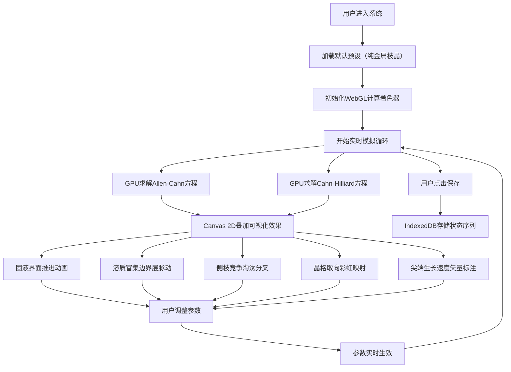

# 相场法枝晶生长实时模拟系统 - 产品需求文档

## 1. 产品概述

基于Allen-Cahn与Cahn-Hilliard耦合相场法的浏览器端枝晶生长实时模拟系统，使用WebGL实现GPU加速求解，面向材料科学研究者、计算物理学者和教育场景用户，提供直观的晶体生长动力学可视化和参数调优平台。

- 核心价值：在浏览器端实现高性能的相场数值模拟，无需安装专业软件
- 目标用户：材料科学研究者、物理学教师、理工科学生、科普爱好者

## 2. 核心功能

### 2.1 用户角色
| 角色 | 注册方式 | 核心权限 |
|------|---------|---------|
| 普通用户 | 无需注册 | 使用所有模拟功能，保存参数配置到本地 |

### 2.2 功能模块
1. **主模拟界面**：WebGL计算画布，Canvas 2D可视化叠加层
2. **参数控制面板**：初始条件、物理参数、数值参数调整
3. **预设场景库**：4个一键加载的经典模拟场景
4. **数据存储模块**：IndexedDB保存生长序列和参数组合
5. **动画效果层**：多种可视化效果的动态展示

### 2.3 页面详情
| 页面名称 | 模块名称 | 功能描述 |
|---------|---------|---------|
| 主页面 | 模拟画布 | 512×512分辨率WebGL画布，实时显示相场演化 |
| 主页面 | 参数面板 | 晶核位置设置、过冷度滑块、各向异性强度调节、噪声幅值控制 |
| 主页面 | 预设按钮区 | 纯金属枝晶、合金共晶层片、多晶竞争生长、外延薄膜四个预设 |
| 主页面 | 数据控制 | 保存/加载模拟状态、导出截图、录制生长动画 |
| 主页面 | 可视化切换 | 相场云图/溶质云图/矢量场/晶格取向彩虹映射切换 |

## 3. 核心流程

## 4. 用户界面设计

### 4.1 设计风格
- **主色调**：深蓝科技风 - #0a1628 背景，#00d4ff 主色，#ff6b6b 强调色
- **辅助色**：晶格取向彩虹映射 - HSL色轮从红色到紫色的连续光谱
- **按钮风格**：玻璃拟态圆角按钮，发光hover效果，点击时的微缩放动画
- **字体**：标题使用 Orbitron（科技感等宽字体），正文使用 JetBrains Mono
- **布局风格**：左侧固定参数面板，右侧全屏模拟画布，顶部控制栏
- **图标风格**：lucide-vue-next 线性图标，配合发光效果

### 4.2 页面设计概述
| 页面名称 | 模块名称 | UI元素 |
|---------|---------|--------|
| 主页面 | 参数面板 | 分组折叠面板，滑块带实时数值显示，颜色编码的参数类别 |
| 主页面 | 模拟画布 | 全屏Canvas，带网格线可选，鼠标悬停显示坐标和场值 |
| 主页面 | 预设按钮 | 四个渐变背景按钮，带图标和文字，点击后脉冲反馈 |
| 主页面 | 控制栏 | 开始/暂停/重置按钮，FPS显示，模拟时间显示 |
| 主页面 | 可视化图例 | 右侧垂直颜色条，标注相场值、溶质浓度、速度大小 |

### 4.3 响应性
- 桌面端优先，最小支持1280×720分辨率
- 参数面板可折叠，小屏幕自动隐藏为侧边抽屉
- 画布自适应容器大小，保持1:1正方形比例

### 4.4 特殊可视化效果
- **固液界面**：使用Marching Squares算法提取0.5等值线，动态发光边框
- **溶质边界层**：浓度梯度脉动效果，使用正弦函数调制透明度
- **侧枝分叉**：高亮显示曲率较大的区域，闪烁强调竞争过程
- **晶格取向**：每个像素根据局部取向角映射到彩虹色，旋转动画
- **速度矢量**：在生长尖端绘制箭头，长度表示速度大小，颜色表示方向
- **数值artifact可视化**：特别标注坐标轴锁定的枝晶方向、低估的尖端速度等

## 5. 数值模拟特性要求

### 5.1 物理模型
- Allen-Cahn方程：描述相场（序参量）演化，包含界面能、各向异性、驱动项
- Cahn-Hilliard方程：描述溶质扩散，包含化学势、双阱势、耦合项
- 热噪声：Langevin动力学，高斯白噪声注入，可调节幅值

### 5.2 数值方法
- 有限差分法（FDM），二阶中心差分空间离散
- 一阶欧拉时间积分，自适应时间步长
- WebGL片段着色器实现并行计算
- 乒乓纹理（Ping-Pong）技术进行场更新

### 5.3 预设场景参数
| 预设名称 | 晶核数 | 过冷度 | 各向异性 | 噪声 | 界面厚度 |
|---------|-------|-------|---------|------|---------|
| 纯金属枝晶 | 1 | 0.5 | 0.04 | 0.01 | 3.0 |
| 合金共晶层片 | 2 | 0.3 | 0.01 | 0.005 | 4.0 |
| 多晶竞争生长 | 8 | 0.4 | 0.02 | 0.02 | 3.5 |
| 外延薄膜 | 5（底部） | 0.35 | 0.03 | 0.008 | 2.5 |

### 5.4 数值Artifact展示
系统必须能够清晰展示以下数值模拟现象：
1. **网格各向异性**：枝晶生长方向被锁定在±x, ±y坐标轴方向
2. **界面厚度不匹配**：界面厚度与物理曲率半径不匹配导致尖端速度低估
3. **噪声过大效应**：热噪声幅值过大导致侧枝过度密集淹没主枝
4. **网格解析不足**：深过冷下平面界面失稳波长过短，被离散网格"冻结"
