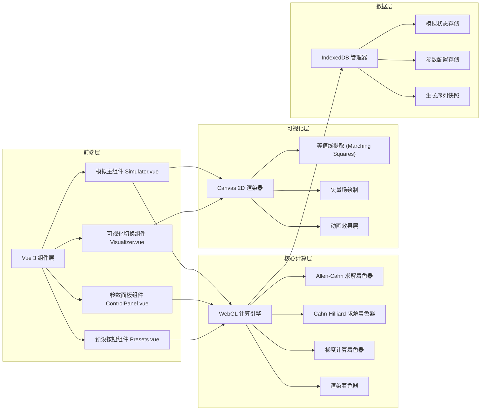

# 相场法枝晶生长实时模拟系统 - 技术架构文档

## 1. 架构设计



## 2. 技术栈描述

- **前端框架**: Vue 3 + TypeScript + Vite
- **样式**: TailwindCSS 3 + 自定义CSS变量
- **GPU计算**: WebGL 2.0 (顶点着色器 + 片段着色器)
- **2D可视化**: Canvas API
- **本地存储**: IndexedDB (idb库封装)
- **状态管理**: Vue Composition API (reactive/ref)
- **图标**: lucide-vue-next

## 3. 项目结构

```
src/
├── components/
│   ├── Simulator.vue          # 主模拟组件 (WebGL + Canvas)
│   ├── ControlPanel.vue       # 参数控制面板
│   ├── PresetButtons.vue      # 预设场景按钮
│   ├── VisualSwitch.vue       # 可视化模式切换
│   ├── StatusBar.vue          # 状态栏 (FPS, 时间)
│   └── ColorBar.vue           # 颜色图例条
├── composables/
│   ├── useWebGL.ts            # WebGL计算引擎封装
│   ├── useSimulation.ts       # 模拟逻辑控制
│   ├── useIndexedDB.ts        # IndexedDB数据管理
│   └── useAnimation.ts        # 动画效果管理器
├── shaders/
│   ├── vertex.glsl            # 通用顶点着色器
│   ├── allenCahn.glsl         # Allen-Cahn方程求解
│   ├── cahnHilliard.glsl      # Cahn-Hilliard方程求解
│   ├── gradient.glsl          # 梯度/曲率计算
│   └── render.glsl            # 场渲染着色器
├── utils/
│   ├── marchingSquares.ts     # 等值线提取算法
│   ├── colorMaps.ts           # 颜色映射函数
│   ├── noise.ts               # 噪声生成函数
│   └── presets.ts             # 预设场景参数
├── types/
│   └── simulation.ts          # 类型定义
├── App.vue
└── main.ts
```

## 4. 核心算法与着色器设计

### 4.1 Allen-Cahn 方程
```glsl
// 求解: ∂φ/∂t = M_φ [ε²∇²φ - f'(φ) + λ∇c·∇φ] + η
// φ: 序参量场 (0=液相, 1=固相)
// ε: 界面厚度参数
// f'(φ): 双阱势导数 = φ(1-φ)(1-2φ)
// λ: 耦合系数
// η: 热噪声 (高斯分布)
```

### 4.2 Cahn-Hilliard 方程
```glsl
// 求解: ∂c/∂t = M_c ∇² [f_c'(φ,c) - κ∇²φ]
// c: 溶质浓度场
// f_c'(φ,c): 化学势
// κ: 梯度能系数
```

### 4.3 各向异性模型
```glsl
// 界面能各向异性: ε(θ) = ε₀ [1 + δ cos(k(θ - θ₀))]
// θ: 界面法向角度
// δ: 各向异性强度
// k: 模次 (4=四次对称, 枝晶生长)
// θ₀: 晶格取向角
```

### 4.4 有限差分格式
```typescript
// 五点差分模板 (二阶中心差分)
// ∇²φ[i,j] ≈ (φ[i+1,j] + φ[i-1,j] + φ[i,j+1] + φ[i,j-1] - 4φ[i,j]) / dx²
// dx = 1.0 (网格间距归一化)
```

## 5. 数据模型

### 5.1 模拟参数类型
```typescript
interface SimulationParams {
  // 物理参数
  undercooling: number;      // 过冷度 ΔT
  anisotropyStrength: number; // 各向异性强度 δ
  anisotropyMode: number;     // 各向异性模次 k
  interfaceThickness: number; // 界面厚度 ε
  noiseAmplitude: number;     // 热噪声幅值
  mobility: number;           // 迁移率 M
  
  // 数值参数
  timeStep: number;           // 时间步长 dt
  gridSize: number;           // 网格分辨率
  
  // 初始条件
  nuclei: Array<{
    x: number;
    y: number;
    radius: number;
    orientation: number;
  }>;
}
```

### 5.2 IndexedDB 数据结构
```typescript
interface SimulationState {
  id: string;
  timestamp: number;
  name: string;
  params: SimulationParams;
  frameNumber: number;
  simulationTime: number;
  // 场数据以Float32Array存储
  phaseField: number[];
  concentrationField: number[];
}

interface PresetConfig {
  id: string;
  name: string;
  description: string;
  params: SimulationParams;
}
```

## 6. 性能优化策略

### 6.1 WebGL 优化
- 使用浮点纹理 (OES_texture_float)
- 乒乓纹理双缓冲技术
- 减少着色器uniform更新频率
- 合理的纹理过滤方式 (NEAREST for FDM)

### 6.2 渲染优化
- Canvas 2D分层渲染
- 离屏Canvas预处理复杂效果
- requestAnimationFrame 帧率控制
- 视锥体剔除 (仅绘制可见区域)

### 6.3 内存优化
- Float32Array 替代 Number[]
- 对象池复用
- 及时释放WebGL资源
- IndexedDB分批写入

## 7. 可视化渲染管线

```
WebGL计算纹理
    ↓
[相场φ] [浓度c] [梯度∇φ] [曲率κ]
    ↓
渲染着色器 → 基础颜色映射
    ↓
Canvas 2D叠加层
    ├─ 固液界面等值线 (Marching Squares)
    ├─ 尖端速度矢量箭头
    ├─ 晶格取向彩虹映射
    ├─ 溶质边界层脉动效果
    └─ 数值artifact标注
    ↓
最终显示
```

## 8. 预设场景配置数据结构

```typescript
const PRESETS = {
  pureMetalDendrite: {
    name: '纯金属枝晶',
    description: '单枝晶生长，展示典型的树枝状形貌',
    params: {
      undercooling: 0.5,
      anisotropyStrength: 0.04,
      anisotropyMode: 4,
      interfaceThickness: 3.0,
      noiseAmplitude: 0.01,
      mobility: 1.0,
      timeStep: 0.05,
      gridSize: 512,
      nuclei: [{ x: 0.5, y: 0.5, radius: 10, orientation: 0 }]
    }
  },
  eutecticLamellar: {
    name: '合金共晶层片',
    description: '双相竞争生长，形成层片状共晶组织',
    params: { /* ... */ }
  },
  polycrystalline: {
    name: '多晶竞争生长',
    description: '多个晶核同时形核，晶界形成过程',
    params: { /* ... */ }
  },
  epitaxialThinFilm: {
    name: '外延薄膜',
    description: '从基底外延生长，展示台阶流动形貌',
    params: { /* ... */ }
  }
}
```
