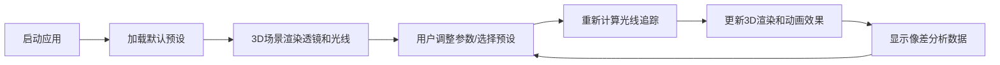

## 1. 产品概述
基于Three.js的3D透镜组光线追踪与像差模拟系统，用于光学教学与演示。用户可添加球面透镜并调整参数，实时观察光线传播路径及各种像差现象（球差、色差、彗差）。
- 核心用途：光学原理可视化教学、透镜系统设计辅助、像差现象直观演示
- 目标用户：物理教师、光学专业学生、光学爱好者

## 2. 核心 Features

### 2.1 Feature Module
1. **主界面**：3D场景视图、控制面板、预设选择、像差数据展示
2. **透镜管理**：添加/删除球面透镜、调整曲率半径、折射率、透镜间距
3. **光线追踪**：多光线发射、折射计算、路径可视化、动态传播动画
4. **像差分析**：球差计算、色差模拟、彗差展示、像点位置实时计算
5. **预设系统**：4个内置预设场景，快速演示典型光学现象
6. **动画系统**：流光动画、光晕闪烁、粒子扩散、光谱渐变、全反射逃逸

### 2.2 Page Details
| Page Name | Module Name | Feature description |
|-----------|-------------|---------------------|
| 主界面 | 3D视窗 | 透镜组三维渲染、光线路径显示、像差可视化 |
| 主界面 | 控制面板 | 透镜参数滑块、添加/删除按钮、预设选择下拉框 |
| 主界面 | 数据面板 | 像点位置、球差值、色差分离距离等实时数据 |
| 主界面 | 预设选择 | 4个内置预设快速切换按钮 |

## 3. Core Process
用户选择预设或手动配置透镜系统，调整参数后系统实时计算光线传播路径，在3D场景中渲染光线轨迹并展示像差效果。

## 4. User Interface Design

### 4.1 Design Style
- **主色调**：深空蓝(#0a1628)背景配合霓虹青(#00f5ff)和光谱渐变色
- **辅助色**：红光(#ff3366)、蓝光(#3366ff)、紫光(#9933ff)用于色差演示
- **按钮风格**：圆角矩形，带发光边框hover效果
- **字体**：JetBrains Mono（等宽字体，科技感）作为主字体
- **布局风格**：左侧3D场景（70%）+ 右侧控制面板（30%），深色科技风格
- **视觉元素**：网格背景、发光线条、粒子效果、玻璃拟态面板

### 4.2 Page Design Overview
| Page Name | Module Name | UI Elements |
|-----------|-------------|-------------|
| 主界面 | 3D视窗 | 深空背景、网格参考线、透镜半透明玻璃材质、光线发光效果 |
| 主界面 | 控制面板 | 玻璃拟态面板、滑块组件、数值输入框、发光按钮 |
| 主界面 | 预设选择 | 标签式选择器、活动状态高亮、图标+文字 |
| 主界面 | 数据面板 | 实时数值显示、像差图表、状态指示器 |

### 4.3 Responsiveness
- 桌面端优先设计，支持1920x1080及以上分辨率
- 平板适配：控制面板可折叠收起
- 触控优化：滑块支持触摸操作

### 4.4 3D Scene Guidance
- **环境**：深空黑色背景，径向渐变营造宇宙感
- **光照**：环境光 + 点光源，透镜使用半透明材质带环境光散射
- **相机**：透视相机，初始位置(-5, 2, 8)，可轨道控制旋转缩放
- **构图**：光轴沿Z轴方向，透镜居中排列，物点在左侧，像点在右侧
- **交互**：OrbitControls支持旋转、缩放、平移，双击重置视角
- **后处理**：Bloom效果增强光线发光感，FXAA抗锯齿
