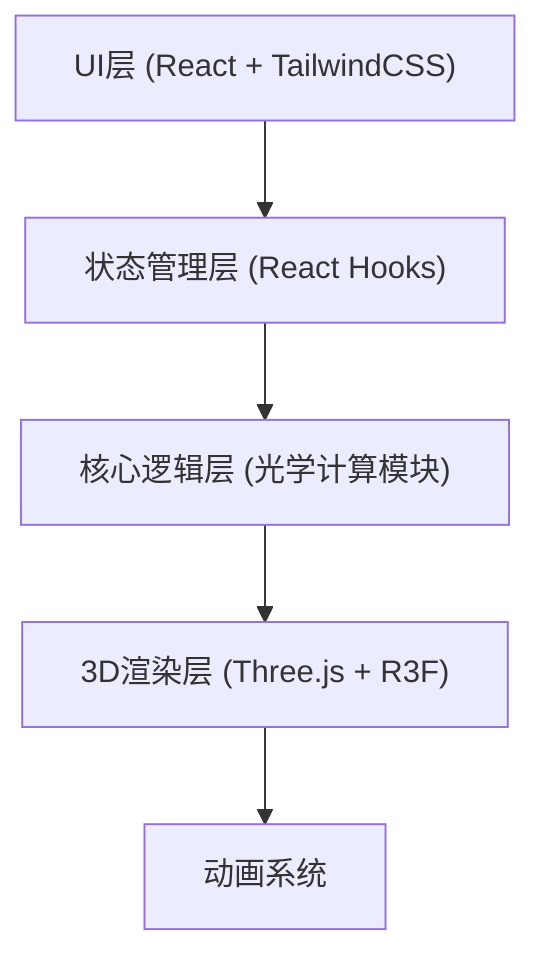
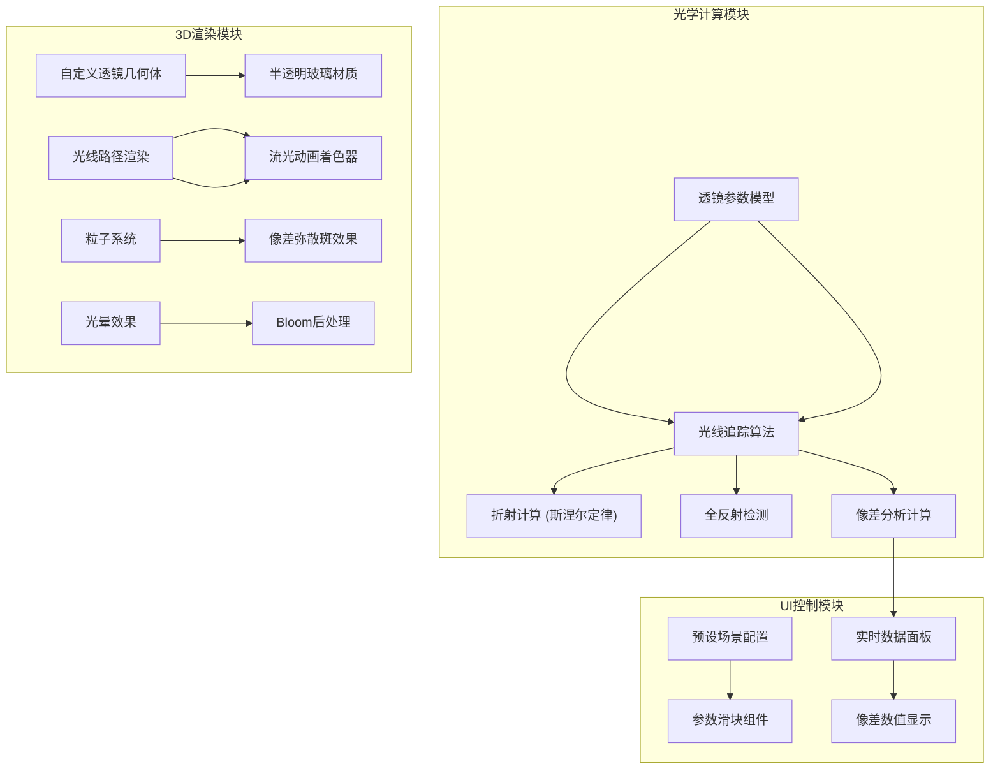

## 1. Architecture Design



## 2. Technology Description
- **前端框架**: React@18 + Vite@5
- **样式方案**: TailwindCSS@3
- **3D渲染**: Three.js@0.160 + @react-three/fiber@8 + @react-three/drei@9
- **后处理效果**: @react-three/postprocessing@2 + postprocessing@6
- **状态管理**: React Context + useReducer
- **数学计算**: 原生JS实现光学折射/反射算法

## 3. Route Definitions
| Route | Purpose |
|-------|---------|
| / | 主应用界面，包含3D场景和控制面板 |

## 4. Core Module Architecture



## 5. Data Model

### 5.1 透镜数据模型
```typescript
interface Lens {
  id: string;
  position: number;           // Z轴位置
  radius1: number;            // 前表面曲率半径
  radius2: number;            // 后表面曲率半径
  thickness: number;          // 透镜厚度
  refractiveIndex: number;    // 折射率
  aperture: number;           // 孔径大小
}
```

### 5.2 光线数据模型
```typescript
interface Ray {
  id: string;
  origin: Vector3;            // 起点
  direction: Vector3;         // 方向
  wavelength: number;         // 波长 (nm)
  path: Vector3[];            // 路径点
  intensity: number;          // 强度
  isTotallyReflected: boolean;// 是否全反射
}
```

### 5.3 预设场景配置
```typescript
interface Preset {
  id: string;
  name: string;
  description: string;
  lenses: LensConfig[];
  objectPoint: Vector3;
  rayCount: number;
  showAberrationType: 'spherical' | 'chromatic' | 'coma' | 'totalReflection';
}
```

## 6. 核心算法说明

### 6.1 斯涅尔定律折射计算
```
n₁ * sin(θ₁) = n₂ * sin(θ₂)
其中 n 为介质折射率，θ 为光线与法线的夹角
```

### 6.2 全反射条件
```
当 n₁ > n₂ 且 θ₁ > θ_c 时发生全反射
临界角 θ_c = arcsin(n₂/n₁)
```

### 6.3 色散失配模型
```
柯西公式: n(λ) = A + B/λ²
其中 λ 为波长，A、B 为材料常数
```

### 6.4 球差计算
```
球差 = 近轴焦点位置 - 边缘光线焦点位置
```
