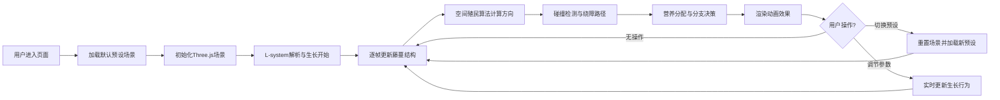

## 1. 产品概述
交互式藤蔓生长系统，基于Three.js和L-system实现参数化植物生长模拟，支持用户自定义光照、障碍物与生长参数，展示复杂的植物生长算法与动画效果。
- 核心目的：提供直观的3D可视化界面，演示L-system、空间殖民算法与向光性生长的交互效果
- 目标用户：计算机图形学爱好者、算法学习者、游戏开发者

## 2. 核心功能

### 2.1 功能模块
1. **3D场景主界面**：藤蔓生长可视化、光照指示、障碍物显示
2. **参数控制面板**：生长参数调节、光照方向设置、障碍物管理
3. **预设场景选择**：4种预设演示场景快速切换
4. **动画系统**：逐帧生长动画、叶片展开动画、粒子流线动画

### 2.2 页面详情
| 页面名称 | 模块名称 | 功能描述 |
|-----------|-------------|---------------------|
| 主页面 | 3D画布区域 | Three.js渲染藤蔓生长、光照粒子、障碍物球体，支持鼠标交互旋转视角 |
| 主页面 | 左侧控制面板 | 生长参数滑块（递归深度、分支角度、生长速度、营养值）、光照方向向量设置、障碍物添加/删除 |
| 主页面 | 顶部预设栏 | 4个预设场景按钮：趋光性缠绕、障碍物死锁、营养耗尽停止、递归深度溢出 |
| 主页面 | 底部状态栏 | 实时显示帧率、递归深度、活跃分支数、碰撞检测次数 |

## 3. 核心流程

用户打开页面 → 默认加载预设一 → 观察藤蔓逐帧生长动画 → 可切换预设场景或手动调节参数 → 观察向光性与绕障效果 → 触发极端条件观察特定现象（死锁、枯萎、帧率下降）

## 4. 用户界面设计

### 4.1 设计风格
- **主色调**：深绿色(#1a472a)渐变背景，模拟森林环境
- **强调色**：荧光绿(#39ff14)用于生长尖端指示，暖黄色(#ffd700)用于光照指示
- **警示色**：枯萎褐色(#8b4513)用于死锁末端，红色(#ff4444)用于碰撞闪烁
- **按钮风格**：半透明玻璃拟态，圆角8px，悬停时有绿色光晕
- **字体**：使用JetBrains Mono等宽字体显示参数，营造科技感
- **布局风格**：左侧固定控制面板，主画布全屏自适应

### 4.2 页面设计概述
| 页面名称 | 模块名称 | UI Elements |
|-----------|-------------|-------------|
| 主页面 | 3D画布 | 暗色背景、雾效、藤蔓绿色渐变、叶片动态旋转、光照粒子流 |
| 主页面 | 控制面板 | 半透明深色面板、滑块组件、数值输入框、开关按钮 |
| 主页面 | 预设栏 | 横向排列按钮组、激活状态高亮、hover缩放效果 |
| 主页面 | 状态栏 | 底部浮动条、实时数据更新、性能指标颜色编码 |

### 4.3 响应式
- Desktop-first设计，主画布占满剩余空间
- 控制面板在小屏幕可折叠为抽屉菜单
- 触摸设备支持双指缩放旋转视角

### 4.4 3D场景指导
- **环境**：深色空间背景，添加微弱的体积雾增强深度感
- **光照**：主光源模拟太阳光，辅助光填充阴影，环境光提供基础照明
- **相机**：PerspectiveCamera，初始位置(0, 5, 15)，支持OrbitControls交互
- **组合**：藤蔓位于中心，光照粒子从光源位置流向生长点，障碍物分散在空间中
- **后处理**：Bloom效果增强发光边缘，FXAA抗锯齿
- **性能**：实例化渲染优化大量叶片，对象池复用藤蔓段几何体
