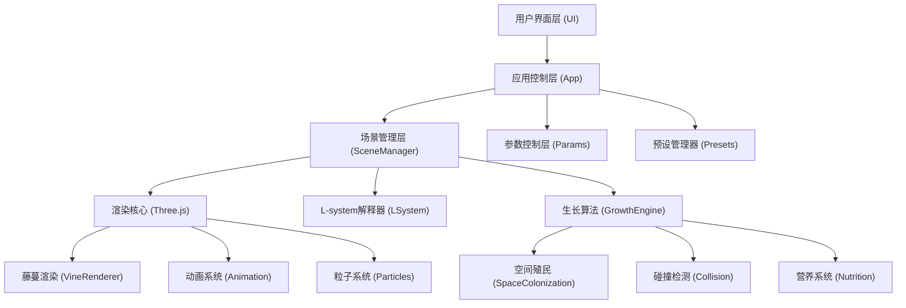

## 1. 架构设计



## 2. 技术描述

- **前端框架**: React@18 + TypeScript + Vite
- **3D引擎**: Three@0.160.0 + @react-three/fiber@8.15.12 + @react-three/drei@9.92.7
- **后处理**: @react-three/postprocessing@2.15.11
- **样式**: TailwindCSS@3.4.1
- **状态管理**: Zustand@4.4.7
- **无后端架构**: 纯前端应用，所有计算在浏览器端完成

## 3. 核心模块定义

### 3.1 目录结构
```
src/
├── components/
│   ├── ui/                    # UI组件
│   │   ├── ControlPanel.tsx   # 控制面板
│   │   ├── PresetBar.tsx      # 预设栏
│   │   └── StatusBar.tsx      # 状态栏
│   └── canvas/                # 3D画布组件
│       ├── VineScene.tsx      # 主场景
│       ├── Vine.tsx           # 藤蔓组件
│       ├── Obstacle.tsx       # 障碍物
│       └── LightParticles.tsx # 光照粒子
├── engine/                    # 核心算法
│   ├── LSystem.ts             # L-system解释器
│   ├── GrowthEngine.ts        # 生长引擎
│   ├── SpaceColonization.ts   # 空间殖民算法
│   ├── CollisionDetector.ts   # 碰撞检测
│   └── NutritionSystem.ts     # 营养系统
├── store/                     # 状态管理
│   └── useStore.ts
├── types/                     # 类型定义
│   └── vine.ts
├── utils/                     # 工具函数
│   ├── geometry.ts
│   └── animation.ts
└── presets/                   # 预设配置
    └── index.ts
```

### 3.2 核心数据结构

```typescript
// 藤蔓节点
interface VineNode {
  id: string;
  position: Vector3;
  direction: Vector3;
  thickness: number;
  depth: number;
  nutrition: number;
  isGrowing: boolean;
  isDead: boolean;
  age: number;
}

// 藤蔓分支
interface VineBranch {
  id: string;
  nodes: VineNode[];
  leaves: Leaf[];
  parentId: string | null;
  depth: number;
}

// 叶片
interface Leaf {
  id: string;
  position: Vector3;
  rotation: Euler;
  scale: number;
  growthProgress: number;
}

// 障碍物
interface Obstacle {
  id: string;
  position: Vector3;
  radius: number;
}

// 生长参数
interface GrowthParams {
  maxDepth: number;
  branchAngle: number;
  growthSpeed: number;
  nutritionTotal: number;
  branchProbability: number;
  phototropismWeight: number;
  obstacleAvoidanceWeight: number;
}
```

### 3.3 L-system 产生式规则

```typescript
// 公理: F
// 规则: F → F[+F][-F]F
// 符号含义:
// F: 向前生长一段
// [: 保存当前状态
// ]: 恢复保存的状态
// +: 向左旋转
// -: 向右旋转
// &: 向下旋转
// ^: 向上旋转
```

## 4. 动画系统设计

| 动画类型 | 实现方式 | 触发条件 |
|----------|----------|----------|
| 藤蔓逐帧生长 | 每帧更新节点position，lerp插值 | 生长周期触发 |
| 叶片展开动画 | 动态更新scale和rotation | 节点成熟度>0.7时触发 |
| 光照粒子流线 | BufferGeometry更新顶点位置，沿着光向量流动 | 持续播放 |
| 碰撞闪烁 | 材质emissive强度脉冲变化 | 碰撞检测触发 |
| 枯萎渐变 | 材质color从green插值到brown | 营养耗尽或死锁时触发 |

## 5. 性能优化策略

1. **实例化渲染**: 所有叶片使用InstancedMesh，减少draw call
2. **对象池**: 复用藤蔓段几何体，避免频繁GC
3. **LOD系统**: 远距离藤蔓降低细节
4. **帧率控制**: 复杂场景自动降低生长精度
5. **空间分区**: Octree优化碰撞检测性能

## 6. 预设场景配置

### 预设一: 单光源直射趋光性
- 光照方向: (1, 2, 0.5) 归一化
- 障碍物: 0个
- 递归深度: 8
- 向光性权重: 0.8

### 预设二: 障碍物死锁
- 光照方向: (0, 1, 0)
- 障碍物: 5个密集排列
- 递归深度: 12
- 绕障权重: 0.9

### 预设三: 营养耗尽停止
- 初始营养: 50
- 每段消耗: 2
- 递归深度: 20
- 分支概率: 0.7

### 预设四: 递归深度溢出
- 递归深度: 25
- 分支概率: 0.95
- 生长速度: 2x
- 关闭碰撞检测
