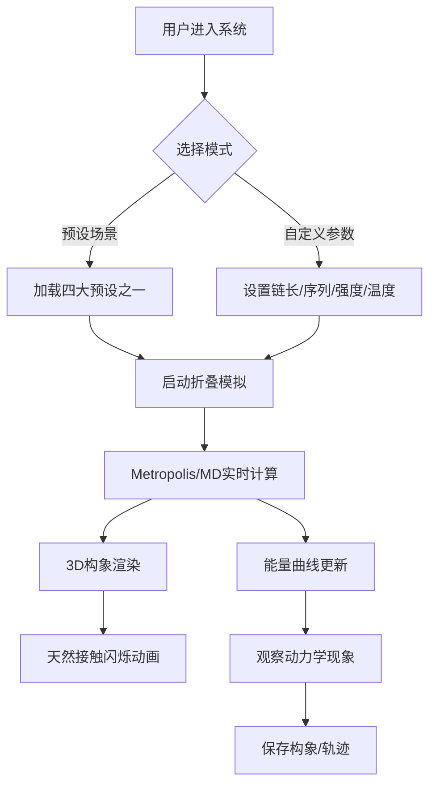

## 1. 产品概述

基于疏水-极性（HP）格点模型的蛋白质链折叠过程与能量景观实时可视化系统，用于科研教学场景，帮助用户直观理解蛋白质折叠动力学过程、能量景观理论及格点模型的局限性。

- **核心价值**：将抽象的蛋白质折叠理论转化为可交互的三维可视化体验
- **目标用户**：生物物理研究人员、生物信息学学生、计算生物学教育者
- **技术定位**：浏览器端高性能科学计算可视化平台

## 2. 核心功能

### 2.1 功能模块

1. **三维可视化主场景**：蛋白质链3D格点折叠实时渲染、能量景观曲面、天然接触高亮
2. **参数控制面板**：链长度、氨基酸序列、疏水相互作用强度、退火温度调节
3. **模拟引擎**：Metropolis蒙特卡洛采样、分子动力学模拟、模拟退火算法
4. **数据可视化面板**：自由能变化曲线、天然接触数统计、温度变化轨迹
5. **预设场景系统**：四大经典折叠场景一键加载
6. **数据持久化**：IndexedDB存储折叠轨迹、低能构象快照

### 2.2 页面详情

| 页面名称 | 模块名称 | 功能描述 |
|-----------|-------------|---------------------|
| 主界面 | 3D场景画布 | Three.js实时渲染蛋白质折叠过程、能量景观滚球动画、残基闪烁效果 |
| 主界面 | 左侧控制面板 | 参数调节滑块、预设按钮组、模拟控制（开始/暂停/重置） |
| 主界面 | 右侧数据面板 | 能量曲线图、接触数统计、构象快照序列、折叠状态指标 |
| 主界面 | 底部状态栏 | 当前温度、自由能、天然接触数、模拟步数实时显示 |

## 3. 核心流程

用户进入系统 → 选择预设场景或自定义参数 → 启动折叠模拟 → 实时观察三维构象变化与能量曲线 → 查看中间体构象快照 → 保存低能构象到本地

## 4. 用户界面设计

### 4.1 设计风格

- **主色调**：深空蓝 (#0a1628) 背景，生物蓝 (#1e88e5) 主色，能量橙 (#ff7043) 强调色
- **疏水残基**：橙红色球体 (#e53935)
- **极性残基**：天蓝色球体 (#29b6f6)
- **天然接触**：荧光绿高亮 (#76ff03) 带脉冲动画
- **字体**：展示字体使用 Orbitron（科技感），正文字体使用 Roboto Mono（ monospace 增强数据感）
- **布局**：暗黑科技风格，玻璃拟态面板，发光边框效果
- **动画风格**：流畅的物理动画，缓动函数使用 cubic-bezier(0.4, 0, 0.2, 1)

### 4.2 3D场景设计

- **环境**：深空黑色背景，雾效营造深度感
- **光照**：三盏方向灯 + 环境光，金属质感PBR材质
- **相机**：轨道控制器，默认45度视角，支持缩放平移
- **格点**：半透明晶格线框，辅助空间定位
- **后处理**：Bloom发光效果，残基接触时的辉光

### 4.3 响应式设计

桌面端优先布局，支持1920×1080以上分辨率。控制面板固定宽度，3D画布自适应剩余空间。触控设备支持手势缩放旋转。
