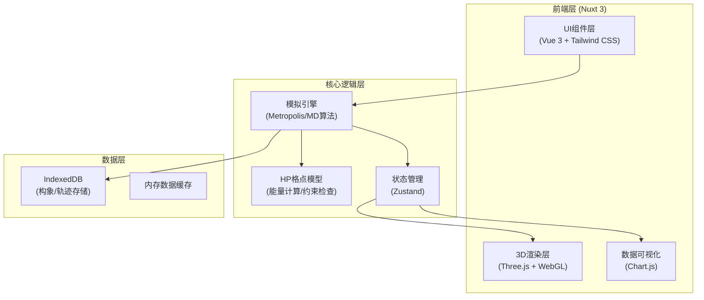

## 1. 架构设计



## 2. 技术描述

- **前端框架**：Nuxt 3 + Vue 3 + TypeScript
- **3D渲染**：Three.js r158 + OrbitControls + EffectComposer
- **样式方案**：Tailwind CSS 3 + 自定义CSS变量主题
- **状态管理**：Zustand 4
- **数据可视化**：Chart.js 4
- **数据存储**：IndexedDB (idb 7 包装库)
- **构建工具**：Vite 5
- **动画库**：GSAP 3 (用于复杂时序动画)

## 3. 核心目录结构

```
src/
├── components/
│   ├── ProteinViewer.vue      # 3D蛋白质可视化主组件
│   ├── ControlPanel.vue       # 参数控制面板
│   ├── EnergyChart.vue        # 能量曲线图
│   ├── PresetButtons.vue      # 预设场景按钮
│   └── ConformationGallery.vue # 构象快照库
├── composables/
│   ├── useSimulation.ts       # 模拟引擎组合式函数
│   ├── useHPModel.ts          # HP模型计算逻辑
│   └── useIndexedDB.ts        # IndexedDB存储封装
├── stores/
│   └── simulationStore.ts     # 模拟状态管理
├── utils/
│   ├── geometry.ts            # 格点几何计算
│   ├── energy.ts              # 能量计算函数
│   └── animation.ts           # 动画辅助函数
├── types/
│   └── hp-model.ts            # 类型定义
└── presets/
    └── scenarios.ts           # 四大预设场景配置
```

## 4. 数据模型

### 4.1 核心数据结构

```typescript
// 氨基酸残基类型
type ResidueType = 'H' | 'P'; // 疏水H / 极性P

// 3D格点坐标
interface Point3D {
  x: number;
  y: number;
  z: number;
}

// 蛋白质构象
interface Conformation {
  id: string;
  sequence: ResidueType[];
  positions: Point3D[];
  energy: number;
  nativeContacts: number;
  temperature: number;
  step: number;
  timestamp: number;
}

// 模拟参数
interface SimulationParams {
  chainLength: number;
  sequence: ResidueType[];
  hydrophobicStrength: number; // 疏水相互作用强度ε
  initialTemperature: number;
  coolingRate: number;
  simulationMethod: 'metropolis' | 'molecular-dynamics';
}

// 折叠轨迹
interface FoldingTrajectory {
  id: string;
  name: string;
  params: SimulationParams;
  conformations: Conformation[];
  createdAt: number;
}
```

### 4.2 IndexedDB存储结构

| Object Store | 主键 | 索引 | 用途 |
|--------------|------|------|------|
| conformations | id | energy, step, temperature | 存储低能构象快照 |
| trajectories | id | createdAt, chainLength | 存储完整折叠轨迹 |
| presets | id | name | 用户自定义预设场景 |

## 5. 核心算法说明

### 5.1 HP格点模型能量计算

```
E = -ε × N_HH
其中:
- ε: 疏水相互作用强度 (可调参数)
- N_HH: 非键合疏水残基对的空间接触数
- 接触定义: 曼哈顿距离=1且序列距离>1
```

### 5.2 Metropolis接受准则

```
P(accept) = min(1, exp(-ΔE / kT))
其中:
- ΔE: 能量变化
- k: 玻尔兹曼常数 (取1简化)
- T: 当前温度
```

### 5.3 格点移动类型

1. **末端摆动**：链末端残基旋转到相邻空格点
2. **曲柄运动**：中间两个残基的90度旋转
3. **滑块移动**：连续残基沿链方向滑动

## 6. 预设场景配置

### 6.1 快速两态折叠预设
- 链长: 16
- 序列: 两端疏水，中间极性
- 温度: 快速退火 (5.0→0.5)
- 现象: 清晰的两态转变，天然态形成快

### 6.2 玻璃态动力学陷阱预设
- 链长: 20
- 序列: 疏水残基分散分布
- 温度: 极快冷却 (10.0→0.1)
- 现象: 动力学冻结，陷入亚稳态

### 6.3 螺旋结构偏好预设
- 链长: 24
- 序列: H-P-H-P周期性重复
- 温度: 中等退火速率
- 现象: 形成螺旋状构象

### 6.4 多域独立折叠预设
- 链长: 32
- 序列: 两段疏水簇被长极性连接
- 温度: 分步退火
- 现象: 两结构域分别折叠后组装
