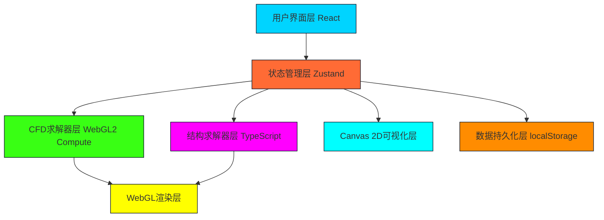

# 圆柱绕流与流致振动耦合模拟系统 - 技术架构文档

## 1. 整体架构设计



## 2. 技术栈说明

### 2.1 核心技术栈
| 层级 | 技术选型 | 版本 | 用途 |
|-----|---------|-----|------|
| 前端框架 | React | 18.x | UI组件化开发 |
| 类型系统 | TypeScript | 5.x | 类型安全保证 |
| 构建工具 | Vite | 5.x | 快速开发与构建 |
| 样式方案 | Tailwind CSS | 3.x | 原子化CSS框架 |
| 状态管理 | Zustand | 4.x | 轻量级全局状态管理 |
| GPU计算 | WebGL2 | - | CFD求解与渲染 |
| 数据可视化 | Canvas 2D | - | 辅助图表绘制 |

### 2.2 项目依赖
```json
{
  "dependencies": {
    "react": "^18.2.0",
    "react-dom": "^18.2.0",
    "zustand": "^4.5.0",
    "lucide-react": "^0.344.0"
  },
  "devDependencies": {
    "@types/react": "^18.2.0",
    "@types/react-dom": "^18.2.0",
    "typescript": "^5.3.0",
    "vite": "^5.1.0",
    "tailwindcss": "^3.4.0",
    "postcss": "^8.4.0",
    "autoprefixer": "^10.4.0"
  }
}
```

## 3. 目录结构设计

```
src/
├── components/              # React组件
│   ├── ControlPanel.tsx    # 参数控制面板
│   ├── PresetButtons.tsx   # 预设按钮组
│   ├── VisualizationTabs.tsx # 可视化Tab切换
│   ├── LissajousCanvas.tsx # 李萨如图画布
│   ├── SpectrumCanvas.tsx  # 频谱瀑布图画布
│   ├── WakeCanvas.tsx      # 尾流恢复画布
│   └── BifurcationCanvas.tsx # 分岔图画布
│
├── hooks/                   # 自定义Hooks
│   ├── useCFDSolver.ts     # CFD求解器Hook
│   ├── useStructureSolver.ts # 结构求解器Hook
│   └── useWebGLRenderer.ts # WebGL渲染Hook
│
├── solvers/                 # 求解器核心
│   ├── CFD/                # CFD求解器
│   │   ├── MacGrid.ts      # MAC交错网格
│   │   ├── Projection.ts   # 投影法求解
│   │   ├── Advection.ts    # 对流项求解
│   │   ├── Diffusion.ts    # 扩散项求解
│   │   └── Boundary.ts     # 边界条件处理
│   │
│   └── Structure/          # 结构求解器
│       ├── SDOFSolver.ts   # 单自由度求解器
│       └── ForceCalculation.ts # 流体力计算
│
├── rendering/               # 渲染模块
│   ├── webgl/              # WebGL渲染
│   │   ├── VorticityShader.ts # 涡量场着色器
│   │   ├── ShaderProgram.ts # 着色器程序封装
│   │   └── Framebuffer.ts  # 帧缓冲对象
│   │
│   └── canvas2d/           # Canvas 2D渲染
│       ├── LissajousRenderer.ts # 李萨如图绘制
│       ├── SpectrumRenderer.ts # 频谱瀑布图绘制
│       ├── WakeRenderer.ts # 尾流恢复曲线绘制
│       └── BifurcationRenderer.ts # 分岔图绘制
│
├── store/                   # 状态管理
│   └── simulationStore.ts  # 模拟状态Store
│
├── utils/                   # 工具函数
│   ├── math.ts             # 数学工具
│   ├── fft.ts              # 快速傅里叶变换
│   └── storage.ts          # localStorage封装
│
├── types/                   # 类型定义
│   └── index.ts            # 全局类型定义
│
├── App.tsx                  # 根组件
├── main.tsx                 # 入口文件
└── index.css                # 全局样式
```

## 4. 核心模块设计

### 4.1 CFD求解器设计

#### 4.1.1 MAC交错网格
```typescript
interface MacGrid {
  nx: number;           // x方向网格数
  ny: number;           // y方向网格数
  dx: number;           // 网格间距
  dy: number;           // 网格间距
  u: Float32Array;      // x方向速度（u面）
  v: Float32Array;      // y方向速度（v面）
  p: Float32Array;      // 压力（中心）
  phi: Float32Array;    // 标记函数（用于 immersed boundary）
}
```

#### 4.1.2 投影法求解流程
```
1. 计算对流项（半拉格朗日方法）
2. 计算扩散项（隐式求解或显式）
3. 施加体积力（圆柱immersed boundary力）
4. 求解压力泊松方程（迭代法：Jacobi/GS/SOR）
5. 投影速度场满足散度为零条件
6. 应用边界条件
```

### 4.2 结构求解器设计

#### 4.2.1 单自由度运动方程
```typescript
// m*y'' + c*y' + k*y = F(t)
// 其中: m=质量, c=阻尼, k=刚度, F=流体力
interface StructureState {
  y: number;             // 横向位移
  y_dot: number;         // 速度
  y_ddot: number;        // 加速度
  force: number;         // 流体力（升力）
  drag: number;          // 阻力
}
```

#### 4.2.2 时间积分方法
采用Newmark-β法或中心差分法，保证与CFD时间步长匹配。

### 4.3 流固耦合策略
```
┌──────────────┐        ┌──────────────┐
│   流场求解    │ ─────→ │  流体力计算   │
└──────────────┘        └──────┬───────┘
       ↑                       │
       │                       ↓
┌──────┴───────┐        ┌──────────────┐
│ 网格变形更新  │ ←───── │  结构运动求解  │
└──────────────┘        └──────────────┘
```

## 5. WebGL渲染架构

### 5.1 着色器设计

#### 5.1.1 顶点着色器
```glsl
#version 300 es
in vec2 a_position;
out vec2 v_uv;
void main() {
  v_uv = a_position * 0.5 + 0.5;
  gl_Position = vec4(a_position, 0.0, 1.0);
}
```

#### 5.1.2 涡量场片段着色器
```glsl
#version 300 es
precision highp float;
in vec2 v_uv;
uniform sampler2D u_vorticity;
uniform float u_vorticityScale;
out vec4 fragColor;

void main() {
  float vort = texture(u_vorticity, v_uv).x * u_vorticityScale;
  // 蓝-白-红伪彩色映射
  float t = clamp(vort * 0.5 + 0.5, 0.0, 1.0);
  vec3 color = mix(
    vec3(0.0, 0.0, 1.0),
    mix(vec3(1.0, 1.0, 1.0), vec3(1.0, 0.0, 0.0), t),
    step(0.0, vort)
  );
  fragColor = vec4(color, 1.0);
}
```

### 5.2 渲染流程
```
1. 求解速度场u, v
2. 计算涡量 ω = ∂v/∂x - ∂u/∂y
3. 将涡量数据上传到纹理
4. 绘制全屏四边形应用着色器
5. 叠加绘制圆柱几何
```

## 6. 状态管理设计

```typescript
interface SimulationState {
  // 模拟参数
  reynolds: number;        // 雷诺数
  diameter: number;        // 圆柱直径
  stiffness: number;       // 弹簧刚度
  damping: number;         // 阻尼比
  mass: number;            // 结构质量
  
  // 运行状态
  isRunning: boolean;
  time: number;
  timeStep: number;
  
  // 数据记录
  displacementHistory: number[];
  velocityHistory: number[];
  liftHistory: number[];
  dragHistory: number[];
  
  // Actions
  setParams: (params: Partial<SimulationParams>) => void;
  start: () => void;
  pause: () => void;
  reset: () => void;
  saveSnapshot: () => void;
  loadSnapshot: () => void;
}
```

## 7. 数据持久化设计

```typescript
// localStorage存储结构
interface SnapshotData {
  version: string;
  timestamp: number;
  params: {
    reynolds: number;
    diameter: number;
    stiffness: number;
    damping: number;
  };
  flowField: {
    u: number[];
    v: number[];
    p: number[];
  };
  structure: {
    displacement: number[];
    velocity: number[];
    lift: number[];
    time: number[];
  };
}
```

## 8. 性能优化策略

### 8.1 计算优化
- WebGL2 Compute Shader加速泊松方程求解
- 半拉格朗日对流减少数值耗散
- 多重网格加速压力求解（可选）

### 8.2 渲染优化
- 离屏Canvas缓存静态元素
- requestAnimationFrame同步渲染
- 帧率自适应调整

### 8.3 内存优化
- Float32Array替代Number数组
- 环形缓冲区存储历史数据
- 纹理复用避免频繁创建

## 9. 预设场景配置

```typescript
const PRESETS = {
  stable: {
    name: "低雷诺数稳定附着",
    reynolds: 10,
    diameter: 0.1,
    stiffness: 1000,
    damping: 0.1,
    description: "Re=10，流动对称稳定，无涡脱落"
  },
  critical: {
    name: "临界涡脱落",
    reynolds: 100,
    diameter: 0.1,
    stiffness: 1000,
    damping: 0.05,
    description: "Re=100，规则卡门涡街，St≈0.2"
  },
  lockin: {
    name: "锁定共振",
    reynolds: 200,
    diameter: 0.1,
    stiffness: 50,
    damping: 0.01,
    description: "结构频率接近涡脱频率，大振幅"
  },
  galloping: {
    name: "驰振失稳",
    reynolds: 1000,
    diameter: 0.15,
    stiffness: 20,
    damping: 0.001,
    description: "高Re，负气动阻尼，振幅持续增大"
  }
};
```
